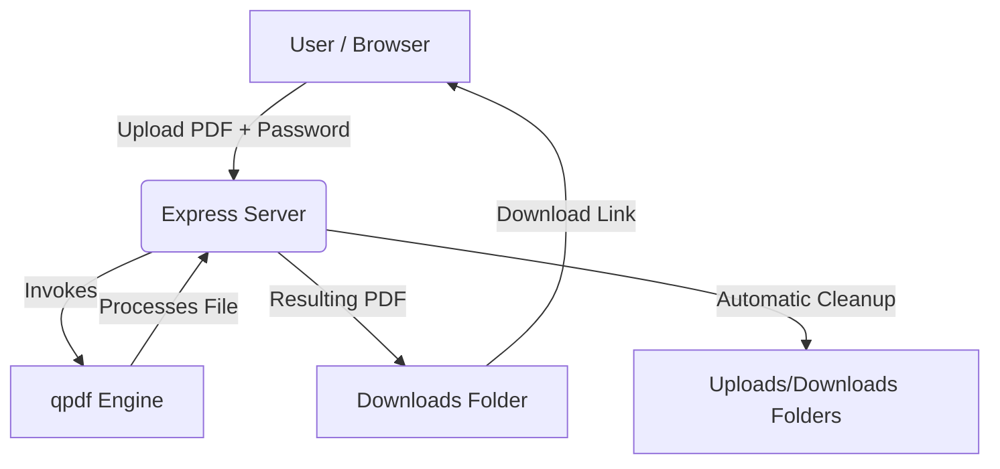

# PDF Password Remover

A secure, local-only web application designed to remove password protection from PDF files.

## 1. Introduction
The **PDF Password Remover** is a private, lightweight web utility designed to unlock PDF files that require a password. Unlike online services, this application performs all operations locally on your machine, ensuring your sensitive documents are never uploaded to a remote server.

## 2. Architecture
The system uses an Express backend to orchestrate the decryption process, invoking a `qpdf` binary. It dynamically detects the operating system to determine how to run `qpdf`.



## 3. Technology Stack
*   **[Node.js](https://nodejs.org/):** Runtime environment for the backend server.
*   **[Express](https://expressjs.com/):** Web framework used for routing and handling API requests.
*   **[Multer](https://github.com/expressjs/multer):** Middleware for handling `multipart/form-data` (PDF file uploads).
*   **[Nodemon](https://nodemon.io/):** Development utility that monitors for changes in your source code and automatically restarts the server.
*   **[qpdf](https://github.com/qpdf/qpdf):** Powerful command-line tool used for PDF structural transformations and decryption.

## 4. How it works
1. **Upload:** You upload a password-protected PDF file via the web interface.
2. **Password Submission:** You enter the correct PDF password.
3. **Decryption:** The server invokes the local `qpdf` engine to create an decrypted, unlocked copy of the PDF.
4. **Download:** The server provides a secure download link for the unlocked file.
5. **Cleanup:** Once the file is downloaded (or if the process fails), the server automatically deletes both the uploaded and generated files to ensure user privacy.

## 5. Prerequisites & Binary Setup (CRITICAL)
This application relies on the `qpdf` binary to perform the actual decryption. It is **OS-aware** and requires different configurations based on your platform:

### Windows
1. Download the latest Windows binary from the [Official qpdf GitHub Releases](https://github.com/qpdf/qpdf/releases).
2. Extract the ZIP file.
3. Copy **`qpdf.exe`** and all associated **`.dll`** files to the `bin/` directory within this project's root folder:
   `C:\path\to\your\project\bin\`

### Linux
1. Install `qpdf` using your system's package manager:
   ```bash
   sudo apt-get update && sudo apt-get install qpdf -y
   ```
   The application will automatically detect `qpdf` from the system PATH.

## 6. Setup
1. Clone the repository.
2. Install the project dependencies:
   ```bash
   npm install
   ```

## 7. Running the Application

### Production
To start the server in production mode:
```bash
npm start
```

### Development
To start the server in development mode (with automatic restarts via `nodemon`):
```bash
npm run dev
```

Once running, access the interface at: `http://localhost:3000`

## 8. Technical Details & Security
*   **Security:** Decryption happens locally. No documents are transmitted over the network.
*   **File Management:** 
    *   Temporary files are stored in `uploads/` and `downloads/`.
    *   The application implements automatic file deletion (`fs.unlinkSync`) after each request (or download completion) to ensure no residual data remains.
*   **Error Handling:**
    *   The server validates the existence of the `qpdf` engine at startup.
    *   If decryption fails (e.g., incorrect password, corrupted file), the server provides explicit JSON error messages and ensures all temporary files are purged.
*   **OS-Awareness:** The server dynamically detects if it is running on Windows (using the bundled binary in `bin/`) or Linux (using the system-installed binary via `qpdf` command).
*   **File Validation:** Middleware restricts uploads to PDF files only (`application/pdf`) to prevent malicious uploads.
