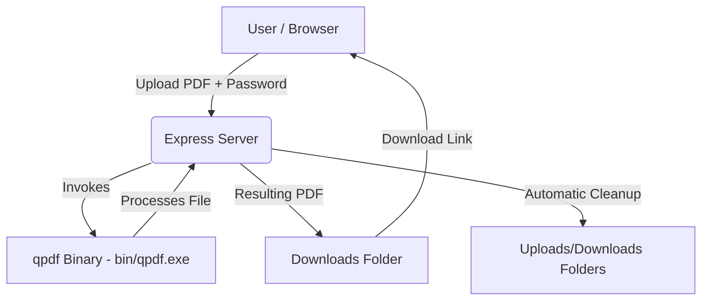

# PDF Password Remover

A secure, local-only web application designed to remove password protection from PDF files.

## 1. Introduction
The **PDF Password Remover** is a private, lightweight web utility designed to unlock PDF files that require a password. Unlike online services, this application performs all operations locally on your machine, ensuring your sensitive documents are never uploaded to a remote server.

## 2. Architecture
The system uses an Express backend to orchestrate the decryption process, invoking a local `qpdf` binary to perform the cryptographic operations.



## 3. Technology Stack
*   **[Node.js](https://nodejs.org/):** Runtime environment for the backend server.
*   **[Express](https://expressjs.com/):** Web framework used for routing and handling API requests.
*   **[Multer](https://github.com/expressjs/multer):** Middleware for handling `multipart/form-data` (PDF file uploads).
*   **[Nodemon](https://nodemon.io/):** Development utility that monitors for changes in your source code and automatically restarts the server.
*   **[qpdf](https://github.com/qpdf/qpdf):** Powerful command-line tool used for PDF structural transformations and decryption.

## 4. Prerequisites & Binary Setup (CRITICAL)
This application relies on the `qpdf` binary to perform the actual decryption. Since this project is portable, you must set up the binary manually:

1.  **Download:** Go to the [Official qpdf GitHub Releases](https://github.com/qpdf/qpdf/releases) and download the latest Windows binary (e.g., `qpdf-x.x.x-mingw64.zip` or `-msvc64.zip`).
2.  **Extract:** Extract the ZIP file.
3.  **Setup `bin/` folder:**
    *   Navigate to the `bin/` folder inside the extracted ZIP.
    *   Copy the file **`qpdf.exe`** and all associated **`.dll`** files found in that folder.
    *   Paste all these files into the `bin/` directory within this project's root folder:
        `C:\path\to\your\project\bin\`
4.  **Verification:** Ensure the path `your-project/bin/qpdf.exe` exists. The server will fail to start if this file is missing.

## 5. Setup
1. Clone the repository.
2. Install the project dependencies:
   ```bash
   npm install
   ```

## 6. Running the Application

### Production
To start the server in production mode:
```bash
npm start
```

### Development
To start the server in development mode (with automatic restarts via `nodemon`):
```bash
npm run dev
```

Once running, access the interface at: `http://localhost:3000`

## 7. Technical Details
*   **Security:** Decryption happens locally. No documents are transmitted over the network.
*   **File Management:** Temporary files are stored in `uploads/` and `downloads/`. The application implements automatic file deletion (`fs.unlinkSync`) after each request to ensure no sensitive documents remain on the server.
*   **Error Handling:** The server validates the existence of the `qpdf` binary at startup and provides explicit error messages if the decryption fails due to invalid passwords or corrupt files.
